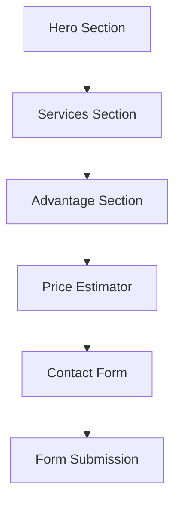

## 1. Product Overview
Logic Lawns is a professional lawn care service business offering reliable, eco-friendly residential lawn maintenance. The single-page application serves as a digital storefront to attract local customers, showcase services, provide instant price estimates, and enable easy booking through a contact form.

Target market: Homeowners in local suburban areas seeking professional, affordable lawn care services with reliable scheduling.

## 2. Core Features

### 2.1 User Roles
| Role | Registration Method | Core Permissions |
|------|---------------------|------------------|
| Visitor | No registration required | Browse services, use price estimator, submit contact form |

### 2.2 Feature Module
The Logic Lawns website consists of the following main sections:
1. **Hero Section**: Professional headline, service area mention, and primary CTA button
2. **Services Section**: Card-based grid displaying three core service packages
3. **Advantage Section**: Highlight compact setup benefits for better pricing and scheduling
4. **Price Estimator Tool**: Interactive calculator for service pricing based on block size
5. **Contact/Booking Form**: Simple form for service inquiries and bookings
6. **Footer**: Business information, credentials, and social links

### 2.3 Page Details
| Page Name | Module Name | Feature description |
|-----------|-------------|---------------------|
| Hero Section | Headline Display | Show "Professional Lawn Care, Handled with Care" with Logic Lawns branding |
| Hero Section | Service Area | Display served suburb/region prominently |
| Hero Section | CTA Button | "Get a Quote" button linking to contact form |
| Services Section | Service Cards Grid | Display three service packages: "The Quick Trim", "Full Residential", "The Clean Up" |
| Services Section | Service Details | Each card shows service name and brief description |
| Advantage Section | Compact Setup Benefits | Explain sedan-sized equipment advantages for pricing and reliability |
| Price Estimator | Interactive Calculator | Select block size (Small/Medium/Large) and service type for estimated pricing |
| Price Estimator | Dynamic Price Display | Show calculated estimate based on selections |
| Contact Form | User Input Fields | Name, Address, Phone, Service Type dropdown |
| Contact Form | Form Submission | Send form data (integrates with Formspree/Netlify) |
| Footer | Business Info | Display ABN, insurance badge placeholder |
| Footer | Social Links | Links to business social media profiles |

## 3. Core Process
Visitor Flow: User lands on hero section → Scrolls to view services → Uses price estimator for cost expectations → Fills contact form for booking → Form submission confirmation

## 4. User Interface Design

### 4.1 Design Style
- **Primary Colors**: Eco-friendly greens (#22c55e, #16a34a)
- **Secondary Colors**: Slate grays (#64748b, #475569)
- **Accent Color**: Clean white (#ffffff)
- **Button Style**: Rounded corners with hover effects using Framer Motion
- **Typography**: Modern sans-serif, responsive font sizes
- **Icon Style**: Lucide React icons for consistency and modern appearance
- **Layout**: Single-page scroll with card-based sections

### 4.2 Page Design Overview
| Page Name | Module Name | UI Elements |
|-----------|-------------|-------------|
| Hero Section | Main Display | Full-width hero with centered content, green accent colors, prominent Logic Lawns logo using Tailwind CSS and Lucide icons |
| Services Section | Card Grid | Three-column responsive grid on desktop, single column mobile, green accent borders, hover animations |
| Price Estimator | Interactive Tool | Dropdown selectors for block size and service type, dynamic price display with smooth transitions |
| Contact Form | Input Interface | Clean white background, green accent buttons, form validation, success message animation |

### 4.3 Responsiveness
Desktop-first design approach with full mobile responsiveness. Optimized for QR code traffic from flyers with fast loading times and touch-friendly interactions.

### 4.4 Animations
Framer Motion implementation for premium feel:
- Smooth scroll animations between sections
- Hover effects on service cards and buttons
- Price estimator number transitions
- Form submission success animations