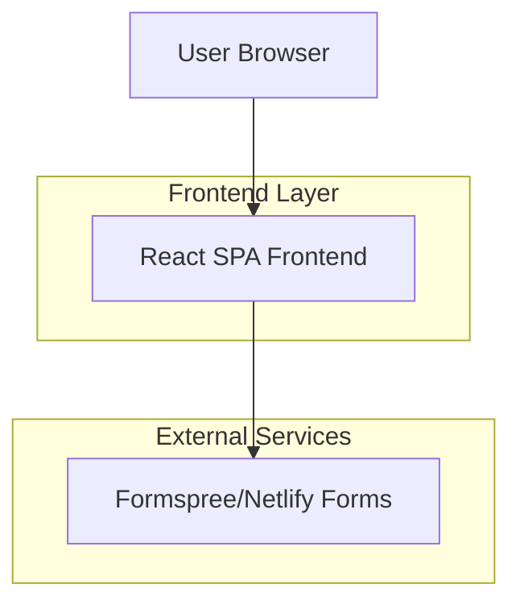

## 1. Architecture Design



## 2. Technology Description

* **Frontend**: React\@18 + TypeScript + Vite

* **Styling**: Tailwind CSS\@3

* **Icons**: Lucide React

* **Animations**: Framer Motion

* **Forms**: Formspree/Netlify Forms integration

* **Initialization Tool**: vite-init

* **Backend**: None (static site with form integration)

## 3. Route Definitions

| Route | Purpose                                   |
| ----- | ----------------------------------------- |
| /     | Single-page application with all sections |

## 4. Component Architecture

### 4.1 Core Components Structure

```
src/
├── components/
│   ├── Hero.tsx
│   ├── Services.tsx
│   ├── Advantage.tsx
│   ├── PriceEstimator.tsx
│   ├── ContactForm.tsx
│   ├── Footer.tsx
│   └── common/
│       ├── Button.tsx
│       ├── Card.tsx
│       └── Logo.tsx
├── hooks/
│   └── usePriceEstimator.ts
├── types/
│   └── index.ts
└── App.tsx
```

### 4.2 Component Dependencies

* Hero: Framer Motion, Tailwind CSS

* Services: Lucide React icons, Framer Motion hover effects

* PriceEstimator: React hooks, Framer Motion animations

* ContactForm: Formspree/Netlify integration, form validation

* Footer: Lucide React social icons

### 4.3 State Management

* Local component state for Price Estimator selections

* Form state management for contact form

* No global state management required for single-page application

### 4.4 Performance Optimizations

* Vite build optimization for fast loading

* Lazy loading for Framer Motion animations

* Optimized images and assets

* Mobile-first responsive design for QR code traffic

## 5. Form Integration Details

### 5.1 Formspree Configuration

```typescript
// Contact form submission handler
const handleSubmit = async (formData: FormData) => {
  const response = await fetch('https://formspree.io/f/[form-id]', {
    method: 'POST',
    headers: {
      'Content-Type': 'application/json'
    },
    body: JSON.stringify(formData)
  });
  
  if (response.ok) {
    // Show success animation
  }
};
```

### 5.2 Form Validation

* Client-side validation for required fields

* Phone number format validation

* Address field validation

* Service type selection validation

## 6. Price Estimator Logic

### 6.1 Pricing Structure

```typescript
interface PriceConfig {
  small: { quickTrim: number; fullResidential: number; cleanUp: number };
  medium: { quickTrim: number; fullResidential: number; cleanUp: number };
  large: { quickTrim: number; fullResidential: number; cleanUp: number };
}
```

### 6.2 Calculation Logic

* Block size selection affects base price multiplier

* Service type determines base service cost

* Dynamic price updates with Framer Motion animations

## 7. Deployment Configuration

### 7.1 Build Configuration

* Vite production build optimization

* Tailwind CSS purging for minimal bundle size

* TypeScript compilation with strict mode

* Asset optimization for mobile devices

### 7.2 Environment Variables

```
VITE_FORMSPREE_ID=your-formspree-id
VITE_BUSINESS_PHONE=your-business-phone
VITE_BUSINESS_EMAIL=your-business-email
```

## 8. Mobile Optimization

### 8.1 Responsive Breakpoints

* Mobile: < 640px (primary target for QR code traffic)

* Tablet: 640px - 1024px

* Desktop: > 1024px

### 8.2 Touch Optimizations

* Large touch targets for buttons

* Optimized form inputs for mobile keyboards

* Smooth scrolling between sections

* Fast loading times for mobile networks

